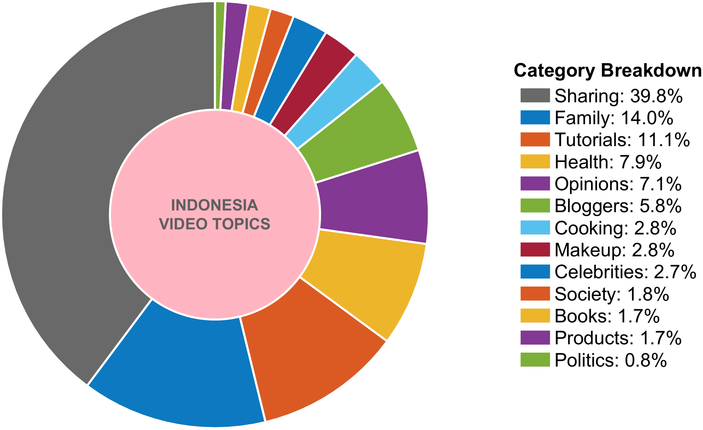
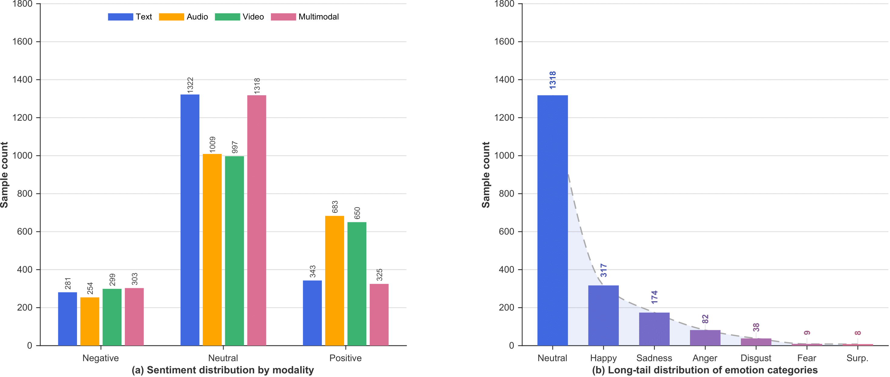

## Introduction
IndoMER DATASET - the first comprehensive benchmark dataset for Indonesian multimodal emotion recognition. Comprising 1944 temporally aligned video segments from social media, IndoMER is meticulously annotated for seven emotions across text, audio, and visual modalities, featuring a well-documented long-tailed class distribution to reflect real-world challenges.

### Dataset Statistics
| Statistics                                        | Number                     |
|---------------------------------------------------|---------------------------:|
| Total source videos                               | 207                        |
| Total video segments                              | 1,944                      |
| Total distinct speakers                           | 203                        |
| &emsp;- *Male segments*                           | 778                        |
| &emsp;- *Female segments*                         | 1,167                      |
| Average segment duration                          | 5.37 sec                   |
| Average word count                                | 11.68 words                |
| Speech rate                                       | 2.17 words/sec             |
| Vocabulary size (unique words)                    | 4,066                      |

### Dataset Topic Distribution

Categorical breakdown of video themes within the IndoMER dataset. The dataset spans thirteen distinct topics, ranging from personal life sharing to specific domains like health and politics. This wide variety of themes is selected to capture rich emotional nuances in different contexts.

### Dataset Annotation Distribution

Distribution of emotional and sentiment annotations in the IndoMER dataset.
(a) Sentiment label distributions across text, audio, and visual modalities, compared with the multimodal consensus (ground truth).
(b) Detailed breakdown of categories within the multimodal annotations, highlighting the long-tailed nature of natural emotional communication.

### Dataset Category Statistics
| Category Type | Category   | Train | Val |
|---------------|------------|------:|----:|
| 7-Class       | Anger      | 69    | 13  |
|               | Disgust    | 33    | 5   |
|               | Fear       | 5     | 4   |
|               | Happiness  | 278   | 39  |
|               | Neutral    | 1,054 | 262 |
|               | Sadness    | 142   | 32  |
|               | Surprise   | 7     | 1   |
| 3-Class       | Negative   | 249   | 54  |
|               | Neutral    | 1,054 | 262 |
|               | Positive   | 285   | 40  |

### Dataset Creation
**Video Acquisition**: This dataset consists of 207 publicly available individual monologue videos collected from social media platforms (e.g., YouTube and TikTok). Each video captures natural multimodal emotional expressions through speech, vocal tone, and facial cues. To ensure content diversity and reduce topic bias, videos were sourced from 13 broad categories (e.g., bloggers, books, celebrities, cooking, family, health, makeup, personal opinions, mild politics, products, sharing, society, and tutorials). All videos include only one primary speaker, and we strictly excluded content involving religion, race, violence, discrimination, or any harmful, offensive, or politically inflammatory language to ensure annotation clarity and ethical compliance. All videos are public and were selected to respect privacy and intellectual property guidelines, with the final dataset designed to represent diverse emotional and communication contexts while avoiding inappropriate or harmful material.

**Segment Verification**: Our dataset was annotated by 7 Indonesian native speakers and 1 language expert for linguistic and cultural quality. Videos were segmented by natural pauses, then manually transcribed in authentic spoken Indonesian without converting to formal language. The expert reviewed transcripts with attention to regional variations. Sentiment was labeled on a –1 to 1 scale (0 = neutral) and finalized by majority agreement (≥2), otherwise decided by the expert using multimodal cues (tone + facial expression + context). Emotions follow Ekman’s 7-category standard (fear, disgust, anger, sadness, happiness, surprise, neutral), rated on a 0–3 intensity scale by 3 annotators, with expert adjudication when inconsistent. The final release contains 1,944 curated and ethically filtered emotional segments.

## Paper
The paper explaining this dataset can be found - [Indonesian Multimodal Emotion Recognition via Auxiliary-Enhanced LLM Adaptation]()

## Download the data


## Repository Structure

```text
INDOMER/
├── 3_class/
│   ├── train.json        # Train split with 3 sentiment categories (negative, neutral, positive)
│   └── val.json          # Validation split with 3 sentiment categories
├── 7_class/
│   ├── train.json        # Train split with 7 emotion categories
│   └── val.json          # Validation split with 7 emotion categories
└── Annotations.csv       # Segment-level metadata, transcripts, and labels
```

## Description of the Annotations.csv files
| Column Name  | Description                                                                                                                                                                                                                                                                                                                                                                                                                                                                                                                                            |
|--------------|--------------------------------------------------------------------------------------------------------------------------------------------------------------------------------------------------------------------------------------------------------------------------------------------------------------------------------------------------------------------------------------------------------------------------------------------------------------------------------------------------------------------------------------------------------|
| video_name      | Video clip names follow the format *clip_number_topic_number.mp4*, where the first number denotes the ID of the full video (a total of 208), and the second number indicates the index of the clip within that video. |
| audio_name      | Audio files follow the same naming convention, sharing the identical clip_number_topic_number structure. |
| emotion | The ground-truth emotion annotation for the sample at the *overall / multimodal level*, assigned to one of the seven predefined categories: *ketakutan, jijik, kemarahan, kesedihan, netral, kebahagiaan,* or *surprise*. |
| sentiment        | The ground-truth sentiment annotation for the sample at the *overall / multimodal level*, assigned to one of the three predefined categories: *negatif, netral,* or *positif*. |
| text_sentiment   | The ground-truth sentiment annotation for the *text modality only*, derived solely from the textual content (e.g., transcript) of the sample, and assigned to one of the three predefined categories: *negatif, netral,* or *positif*. |
| audio_sentiment  | The ground-truth sentiment annotation for the *audio modality only*, derived solely from the acoustic and prosodic characteristics of the speech signal, and assigned to one of the three predefined categories: *negatif, netral,* or *positif*. |
| video_sentiment  | The ground-truth sentiment annotation for the *video modality only*, derived solely from the visual information (e.g., facial expressions and gestures) of the sample, and assigned to one of the three predefined categories: *negatif, netral,* or *positif*. |
| text            | The manually verified transcription of the spoken content in each video clip. |


## Description of Pickle Files

### Feature pickle files

- **Video feature PKLs**  
  - **Location**: `video_feature/train_video_features.pkl` and `val_video_features.pkl`  
  - **Structure**: each PKL file contains a **list** of dictionaries. Every dictionary corresponds to one video segment and has:
    - `video_name`: the clip identifier (e.g., `clip_1_Cooking_1.mp4`).  
    - `video_feature`: a NumPy array of shape \((T_v, D_v)\), where:
      - \(T_v\) is the (padded/truncated) number of visual frames for this clip (fixed within one preprocessing run, equal to the maximum length over all clips for that run).
      - \(D_v\) is the visual feature dimension (673 in the OpenFace configuration).

- **Audio feature PKLs**  
  - **Location**: `audio_feature/train_audio_features.pkl` and `val_audio_features.pkl`  
  - **Structure**: each PKL file contains a **list** of dictionaries. Every dictionary corresponds to one audio segment and has:
    - `audio_name`: the clip identifier (e.g., `clip_1_Cooking_1.wav`).  
    - `audio_feature`: a NumPy array of shape \((T_a, D_a)\), where:
      - \(T_a\) is the (padded/truncated) number of acoustic frames for this clip (fixed within one preprocessing run, equal to the maximum length over all clips for that run).
      - \(D_a\) is the acoustic feature dimension (18-dimensional GeMAPS LLDs).

### How to use the feature PKLs

- **Aligning features with labels and text**  
  - For most use cases, we recommend using the split JSON files (e.g., `7_class/train.json`, `7_class/val.json`) as the main source of **labels** and **transcriptions**.  
  - For **audio features**, use `audio_name` from the PKL (e.g., `clip_1_Cooking_1.wav`) and match it directly to the `audio` field in the JSON files.  
  - For **video features**, use `video_name` from the PKL (e.g., `clip_1_Cooking_1.mp4`) and match it directly to the `video` field in the JSON files.  
  - If you prefer working with the raw `Annotations.csv`, you can still join via the `video_name` / `audio_name` columns, which are consistent with the `video` / `audio` fields in the JSON files.

- **Example (Python)**

```python
import json
import pickle
from pathlib import Path

# Load .json
with open("7_class/train.json", "r", encoding="utf-8") as f:
    json_data = json.load(f)

# Load .pkl
with open(Path("videos_feature/train_video_features.pkl"), "rb") as f:
    video_batch = pickle.load(f)

sample = video_batch[0]
vid_name = sample["video_name"]     # e.g., "clip_1_Cooking_1.mp4"
features = sample["video_feature"]  # NumPy array (T_v, D_v)

row = next((item for item in json_data if item["video"] == vid_name), None)
emotion = row["label"]        # 7-class emotion label
emotion_id = row["label_id"]  # 7-class emotion ID
text = row["text"]            # transcript

print(emotion, emotion_id, text)
```
